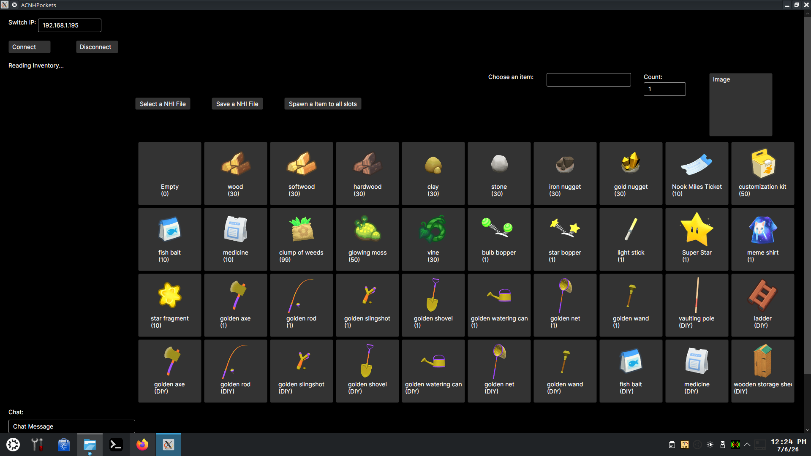
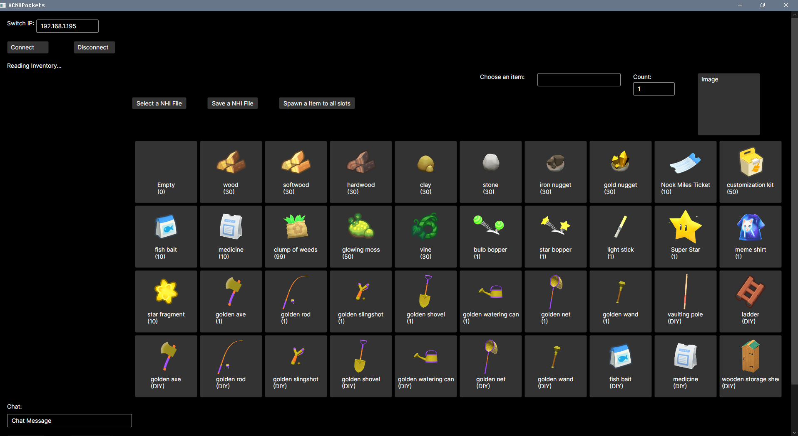

# ACNHPockets

## This app is for Windows or Linux. 
the main reason I made this app because ACNHPokerCore only work on windows.    
It will take a lot of time and removals of windows-only dependencies to make ACNHPokerCore to work on Linux   

## Done:
* Chat function is done.   
* inventory freeze and unfreeze
* read inventory (pockets)
* load nhi's and update pockets 
* ability to clear inventory (pockets)

# TO DO:  
* getting spawning and adding items to work proper

## Prerequisite

   1. A Nintendo Switch capable of running unsigned code.
   2. [sys-botbase](https://github.com/olliz0r/sys-botbase) installed on your Switch.
   3. A copy of Animal Crossing™: New Horizons for the Nintendo Switch
   4. windows or linux computer or device   
   
## Installation

   1. Grab windows exe or linux binary from the release page. 
   2. copy the bin to your preffered place on your computer or device. 
   3. chmod +x if needed to. 
   4. run it.  
   
## Usage  
	
1. put in your switch ip address 
2. click on Connect   
3. The slots should update to whatever you have in your pockets.  

## Credit 
I used a lot of ACNHPokerCore codes for many things in this app. 
Huge Thank you to [MyShiLingStar](https://github.com/MyShiLingStar/ACNHPokerCore)

My fucking brain  

## Screenshots

## Linux (Kunbuntu)

## Windows

   
